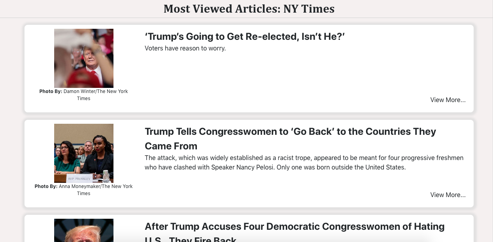
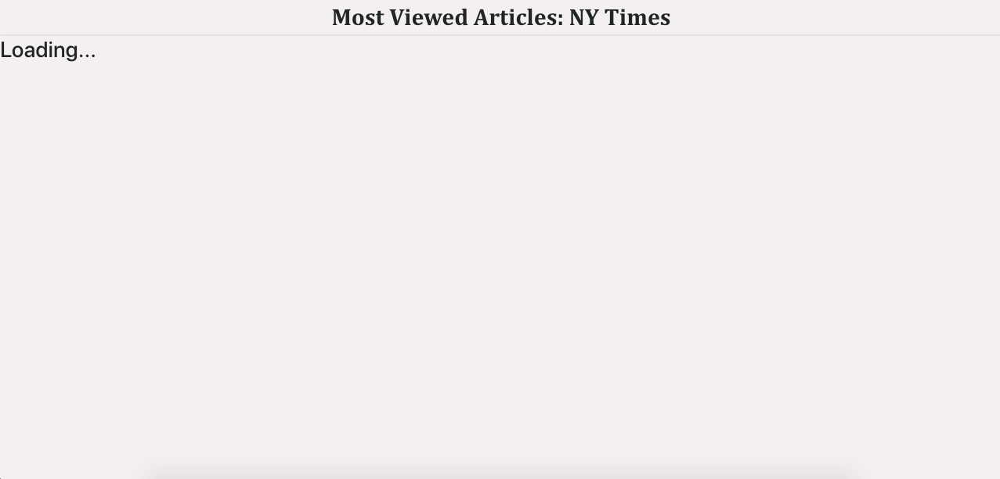
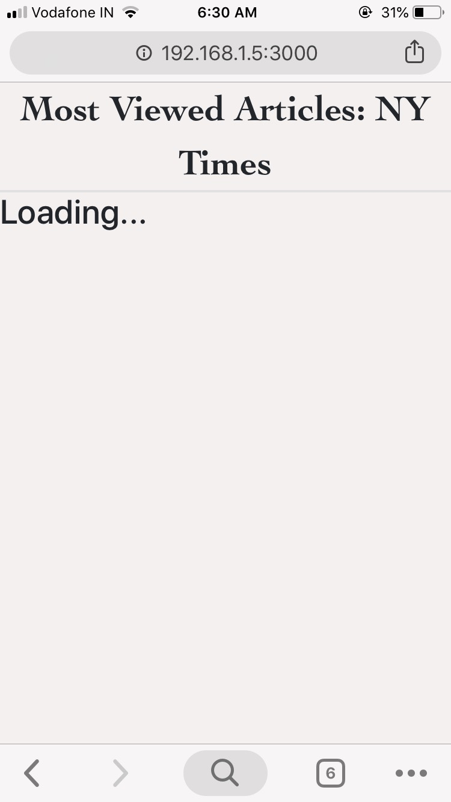
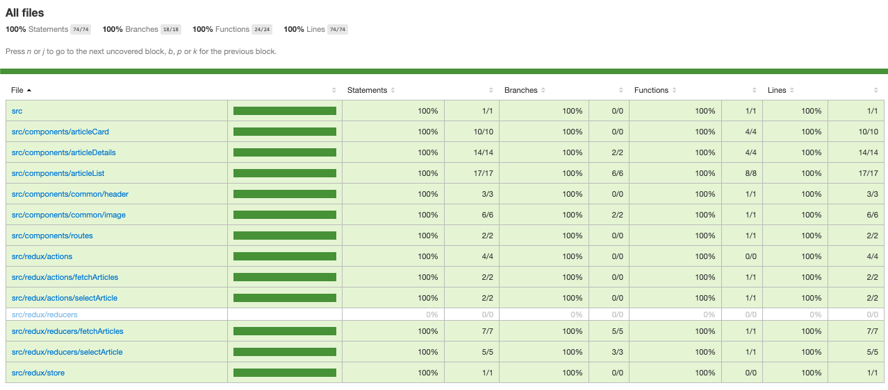

This project was bootstrapped with [Create React App](https://github.com/facebook/create-react-app).

## Application Details

This is an application which lists down the most viewed articled from NY Times.

The app can be viewed on a public link [here](https://sneh-articles-list.netlify.com/)

To Run the application on your local system, perform the following steps:

- Clone this repository on your local machine.
- Open command prompt / terminal.
- Navigate to the Project folder containing `package.json` file.
- Run the following command
    ```
    npm install
    ```
- Once npm install is successful, run the following command
    ```
    npm start
    ```
- If you wish to check the code coverage, you can run the following command:
    ```
    npm run test
    ```
## Screenshots

### Desktop






### Mobile





### Unit Test Coverage



## Available Scripts

In the project directory, you can run:

### `npm install`

Downloads all the dependencies mentioned in the `package.json` file required for the app to work properly.
**This command should be run on a fresh clone**

### `npm start`

Runs the app in the development mode.<br>
Open [http://localhost:3000](http://localhost:3000) to view it in the browser.

The page will reload if you make edits.<br>
You will also see any lint errors in the console.

### `npm run test`

Launches the test runner.<br>
See the section about [running tests](https://facebook.github.io/create-react-app/docs/running-tests) for more information.


